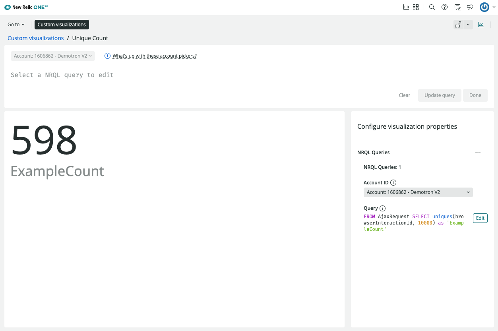

# nr1-unique-count-nerdlet-viz

## About this Nerdpack


If you've ever used the NRQL uniqueCount() function, there is a good chance you have ran into the limitation where it approximates results after 256 unique values. This is okay in most cases but sometimes our use cases require precision. Luckily, with Custom Visualizations and the uniques() function we now have an accurate workaround within the New Relic platform with accuracy up to 10,000. 

Just add the custom visualization to your account and configure it with a NRQL query to add it to a dashboard:

### Examples :  

```
FROM AjaxRequest SELECT uniques(browserInteractionId, 10000) as 'ExampleCount'
```



## Getting started

First, ensure that you have [Git](https://git-scm.com/book/en/v2/Getting-Started-Installing-Git) and [NPM](https://www.npmjs.com/get-npm) installed. If you're unsure whether you have one or both of them installed, run the following command(s) (If you have them installed these commands will return a version number, if not, the commands won't be recognized):

```bash
git --version
npm -v
```

Next, install the [NR1 CLI](https://one.newrelic.com/launcher/developer-center.launcher) by going to [this link](https://one.newrelic.com/launcher/developer-center.launcher) and following the instructions (5 minutes or less) to install and setup your New Relic development environment.

Next, to clone this repository and run the code locally against your New Relic data, execute the following command:

```bash
nr1 nerdpack:clone -r https://github.com/newrelic/nr1-unique-count-nerdlet-viz.git
cd nr1-unique-count-nerdlet-viz
nr1 nerdpack:uuid -gf
npm install
npm start
```

Visit [https://one.newrelic.com/?nerdpacks=local](https://one.newrelic.com/?nerdpacks=local), navigate to the Nerdpack, and :sparkles:

## Deploying this Custom Vizualization

Open a command prompt in the nerdpack's directory and run the following commands.

```bash
# this is to create a new uuid for the nerdpack so that you can deploy it to your account
nr1 nerdpack:uuid -g [--profile=your_profile_name]
# to see a list of APIkeys / profiles available in your development environment, run nr1 credentials:list
nr1 nerdpack:publish [--profile=your_profile_name]
nr1 nerdpack:subscribe [-c [DEV|BETA|STABLE]] [--profile=your_profile_name]
```
For more details see the documentation [here](https://developer.newrelic.com/explore-docs/custom-viz/build-visualization/).  
Visit [https://one.newrelic.com](https://one.newrelic.com), navigate to the Nerdpack, and :sparkles:

# Support

New Relic has open-sourced this project. This project is provided AS-IS WITHOUT WARRANTY OR DEDICATED SUPPORT. Issues and contributions should be reported to the project here on GitHub.

We encourage you to bring your experiences and questions to the [Explorers Hub](https://discuss.newrelic.com) where our community members collaborate on solutions and new ideas.

## Community

> Work with the Explorer's Hub team to create a tag for your app, then update the link below.

New Relic hosts and moderates an online forum where customers can interact with New Relic employees as well as other customers to get help and share best practices. Like all official New Relic open source projects, there's a related Community topic in the New Relic Explorers Hub. You can find this project's topic/threads here:

https://discuss.newrelic.com/t/{{ APP_NAME }}
*(Note: This URL is subject to change before GA)*

## Issues / enhancement requests

Issues and enhancement requests can be submitted in the [Issues tab of this repository](../../issues). Please search for and review the existing open issues before submitting a new issue.

# Contributing

> Work with the Open Source Office to update the email alias below.

Contributions are encouraged! If you submit an enhancement request, we'll invite you to contribute the change yourself. Please review our [Contributors Guide](CONTRIBUTING.md).


## Open source license

This project is distributed under the [Apache 2 license](LICENSE).
